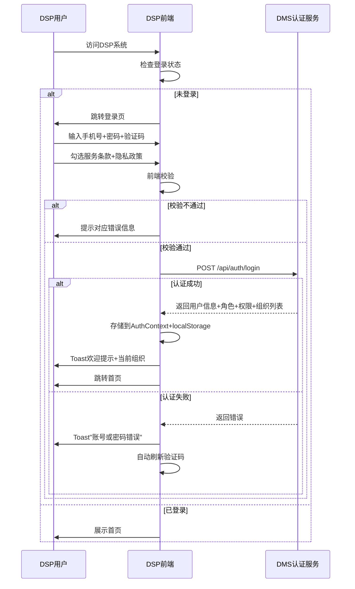
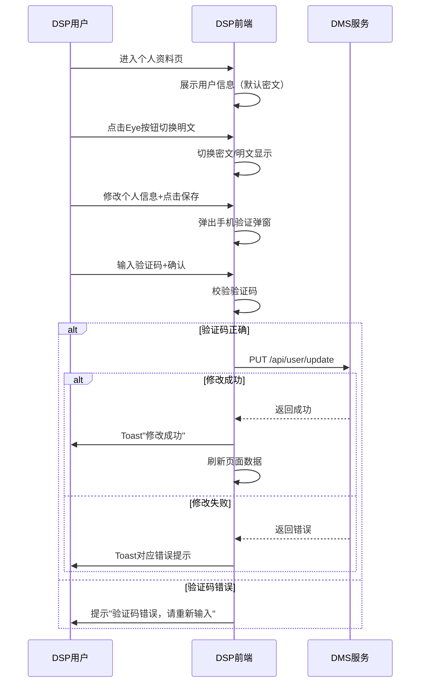
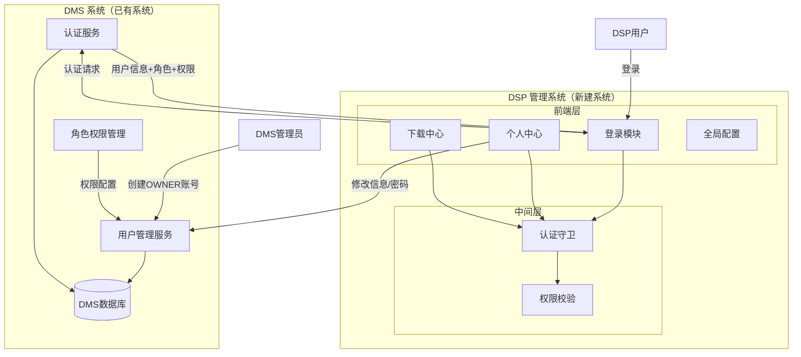
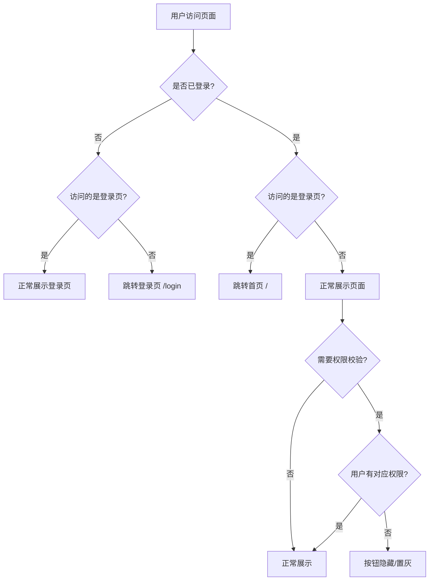
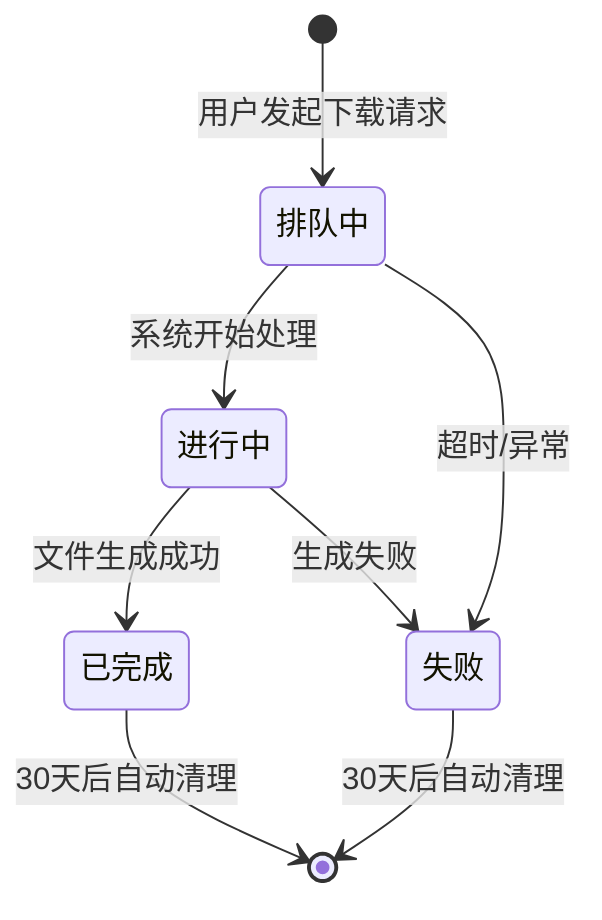

# DSP管理系统基础功能 — 产品需求文档（PRD）

| 字段 | 说明 |
|------|------|
| 需求名称 | DSP管理系统基础功能 |
| 版本号 | V1.0 |
| 状态 | 草稿 |
| 产品负责人 | 待定 |
| 创建日期 | 2026-06-22 |
| 最后更新日期 | 2026-06-22 |
| 产品内部评审时间 | 待定 |
| 产品内部评审人 | 待定 |
| 产品内部参与人 | 待定 |
| 研发评审时间 | 待定 |
| 研发评审人 | 待定 |
| 研发参与人 | 待定 |

**交付物清单：**

| 交付物 | 格式 | 必填 | 说明 |
|--------|------|:----:|------|
| PRD 文档 | Markdown | ✅ | 定义流程、逻辑、规则、提示内容 |
| 原型 | HTML | ✅ | 单文件HTML，位于 `Prototype_Demo/index.html` |

---

## 一、需求概述

### 1.1 需求背景

DSP（配送服务商）管理系统早期为了快速上线，与公司内部运营后台共用同一个域名。随着业务发展，暴露出以下问题：

1. **安全隐患**：虽然权限隔离，但暴露了公司内部系统域名，增加了被恶意扫描和攻击的攻击面。一旦第三方账号泄露，攻击者知道了公司后台入口地址。
2. **用户体验不佳**：系统维护或升级时，内部和外部往往需要同步停机，影响第三方正常配送。
3. **品牌认知模糊**：DSP面对的是类似内部系统的界面，缺乏"GOFO独立合作伙伴"的品牌感知，不利于未来将管理系统作为独立产品向外部推广。

为提升DSP服务质量，强化GOFO品牌，并便于未来推广移动端App或DSP管理服务，决定将DSP管理系统进行物理拆分，启用独立域名，将系统功能解耦。本项目为第一阶段，完成基础功能的搭建。

### 1.2 目标价值 / 影响面

| 序号 | 目标价值 | 说明 |
|:---:|------|------|
| 1 | 安全隔离 | DSP独立域名部署，减少内部系统暴露面，降低被恶意攻击风险 |
| 2 | 独立运维 | DSP系统可独立维护升级，不再受内部系统停机影响，保障第三方配送业务连续性 |
| 3 | 品牌强化 | 独立系统界面体现GOFO品牌，增强DSP合作伙伴的归属感和品牌认知 |
| 4 | 可扩展性 | 为后续移动端App、更多DSP管理服务（结算、报表等）奠定基础 |

**影响用户角色：**
- DSP OWNER（配送服务商所有者）
- DSP manager / finance / cs（配送服务商员工）
- DMS管理员（账号创建）

**影响范围：** Web端（PC管理后台），DMS系统对接

### 1.3 需求涉及端口

本次需求仅涉及 **Web端（PC管理后台）**。

---

## 二、需求业务说明

### 2.1 业务场景拆解

| 所属业务环节 | 角色 | 活动/操作 | 要求与规则（业务场景维度） |
|:---:|:---:|:---:|:---|
| 账号认证 | DSP用户 | 登录系统 | 1. 使用DMS创建的账号登录<br>2. 输入手机号+密码+图片验证码<br>3. 支持记住密码<br>4. 登录页支持语言切换，默认沿用上次选择<br>5. 必须勾选同意服务条款和隐私政策<br>6. 登录后显示欢迎提示和当前DSP组织<br>7. 异常：账号密码错误提示并刷新验证码；验证码错误自动刷新 |
| 个人资料管理 | DSP用户 | 查看/编辑个人资料 | 1. 个人信息默认密文显示，点击切换明文<br>2. 编辑保存需手机验证码验证<br>3. 注销账号不允许直接操作，提示联系上级站点<br>4. 异常：手机验证失败提示重新输入 |
| 密码管理 | DSP用户 | 修改密码 | 1. 密码默认密文显示，支持切换明文<br>2. 密码规则：8-32位，含大写+小写+数字+特殊字符<br>3. 实时密码强度指示<br>4. 异常：当前密码错误提示；两次新密码不一致提示 |
| 日期格式 | DSP用户 | 设置日期格式 | 1. 6种日期格式选项<br>2. 选中实时预览<br>3. 设置后全局生效 |
| 文件下载 | DSP用户 | 查询/下载文件 | 1. 按创建时间（最多31天）、文件名称、文件状态、所属菜单查询<br>2. 单个下载：仅已完成文件<br>3. 批量下载：勾选多条已完成文件<br>4. 30天过期自动清理，页面红色提示<br>5. 异常：无权限下载时提示 |
| 系统配置 | DSP用户 | 组织/时区/语言切换 | 1. 组织切换：顶部下拉选择<br>2. 时区切换：9个时区选项<br>3. 语言切换：中/英/西，localStorage记忆<br>4. 异常：切换失败回退到原值 |
| 退出系统 | DSP用户 | 退出登录 | 1. 二次确认弹窗后执行退出<br>2. 清除登录状态和缓存<br>3. 跳转到登录页 |
| 关联系统 | DSP用户 | 查看关联系统入口 | 1. 顶部导航栏展示关联系统入口图标<br>2. 点击展开Popover，展示DSP App下载二维码、Driver App下载二维码、GOFO官网跳转链接<br>3. 二维码图片为静态资源，官网链接新标签页打开 |

**上下游影响面评估：**

| 所属业务环节 | 角色 | 活动/操作 | 要求与规则 |
|:---:|:---:|:---:|:---|
| DMS账号管理（上游） | DMS管理员 | 创建OWNER账号 | DMS管理员在DMS系统中创建DSP OWNER账号，分配角色和权限 |
| DMS认证服务（上游） | DMS系统 | 提供认证接口 | DSP登录时调用DMS认证接口，返回用户信息+角色+权限 |
| DMS用户管理（上游） | DMS系统 | 提供信息修改接口 | DSP修改个人资料/密码时调用DMS接口 |
| 司机审核（下游） | 审核系统 | 自动创建driver账号 | 审核通过后系统自动在DMS创建driver账号，不在DSP手动创建 |

### 2.2 业务流程图

#### 2.2.1 用户登录流程



#### 2.2.2 个人资料修改流程



### 2.3 系统架构图



### 2.4 系统流程图

#### 认证守卫流程



#### 文件下载状态流转



### 2.5 状态流转图

#### 文件状态流转

| 状态 | 含义 | 触发条件 | 可执行操作 |
|:---:|:---|:---|:---|
| 排队中 | 文件生成请求已提交，等待处理 | 用户触发下载 | 无（等待） |
| 进行中 | 系统正在生成文件 | 队列调度分配 | 无（等待） |
| 已完成 | 文件生成成功，可下载 | 生成完成 | 下载 |
| 失败 | 文件生成失败 | 生成异常/超时 | 无（查看失败原因） |

---

## 三、系统功能设计

### 3.1 功能清单

| 功能模块 | 功能点 | 优先级 | 原型链接 | 说明 |
|:---:|:---:|:---:|:---:|:---|
| 账号登录 | 手机号+密码+验证码登录 | P0 | `Prototype_Demo/index.html` | 核心认证入口 |
| 账号登录 | 语言选择（登录页） | P0 | `Prototype_Demo/index.html` | 中/英/西，记忆上次选择 |
| 账号登录 | 记住密码 | P1 | `Prototype_Demo/index.html` | localStorage本地存储 |
| 账号登录 | 服务条款/隐私政策 | P0 | `Prototype_Demo/index.html` | 外链跳转，新标签页 |
| 个人中心 | 个人资料查看 | P0 | `Prototype_Demo/index.html` | 信息卡片+密文/明文切换 |
| 个人中心 | 个人资料编辑 | P0 | `Prototype_Demo/index.html` | 编辑表单+手机验证 |
| 个人中心 | 密码修改 | P0 | `Prototype_Demo/index.html` | 强度校验+规则提示 |
| 个人中心 | 日期格式设置 | P1 | `Prototype_Demo/index.html` | 6种格式+实时预览 |
| 个人中心 | 注销账号 | P1 | `Prototype_Demo/index.html` | 提示联系上级站点 |
| 下载中心 | 文件列表查询 | P0 | `Prototype_Demo/index.html` | 多条件筛选 |
| 下载中心 | 单个文件下载 | P0 | `Prototype_Demo/index.html` | 仅已完成文件 |
| 下载中心 | 批量文件下载 | P0 | `Prototype_Demo/index.html` | Checkbox多选 |
| 下载中心 | 分页器 | P0 | `Prototype_Demo/index.html` | 翻页/跳转/条数设置 |
| 全局配置 | DSP组织切换 | P0 | `Prototype_Demo/index.html` | 顶部导航下拉 |
| 全局配置 | 时区切换 | P1 | `Prototype_Demo/index.html` | 9个时区选项 |
| 全局配置 | 语言切换 | P0 | `Prototype_Demo/index.html` | 中/英/西，localStorage记忆 |
| 全局配置 | 退出登录 | P0 | `Prototype_Demo/index.html` | 二次确认弹窗 |
| 关联系统 | 关联系统展示（DSP App/Driver App二维码+GOFO官网） | P1 | `Prototype_Demo/index.html` | 顶部导航栏入口 |

### 3.2 功能详细描述

---

### 3.2.1 账号登录

**功能名称：账号登录**

> 详细描述：用户使用DMS系统创建的账号进行登录。输入手机号+密码+图片验证码，支持记住密码和语言切换。登录前需同意服务条款和隐私政策。登录成功后显示欢迎提示和当前DSP组织。
> 页面类型：独立登录页（无顶部导航栏）

> 原型链接：`Prototype_Demo/index.html` → 登录页

---

##### 3.2.1.1【前端逻辑】

**1. 页面字段定义**

| 字段中文名 | 是否必填 | 输入方式 | 格式/校验规则 | 默认值 | 联动/备注 |
|:---:|:---:|:---:|:---|:---:|:---|
| 手机号 | 是 | 文本输入 | 必填；≥10位数字；最大15位 | 空 | 记住密码时自动填充 |
| 密码 | 是 | 密码输入框 | 必填 | 空 | 支持Eye/EyeOff切换明文/密文；记住密码时自动填充 |
| 验证码 | 是 | 文本输入 | 必填；4位字符，不区分大小写 | 空 | 点击验证码图片或刷新按钮刷新 |
| 记住密码 | 否 | Checkbox | — | 不勾选 | 勾选后localStorage存储手机号+密码 |
| 服务条款和隐私政策 | 是 | Checkbox | 必须勾选 | 不勾选 | 服务条款链接：https://www.gofo.com/us/terms-of-use；隐私政策链接：https://www.gofo.com/us/privacy-policy；点击在新标签页打开 |
| 语言选择 | 否 | 下拉选择 | — | 上次退出时选择的语言 | localStorage存储 `dsp-lang` |

**2. 枚举值定义**

| 枚举名称 | 值 | 含义 | 说明 |
|:---:|:---:|:---|:---|
| 语言 | zh-CN | 中文 | 默认语言 |
| 语言 | en-US | English | — |
| 语言 | es-ES | Español | — |

**3. 页面交互说明**

| 操作 | 触发方式 | 系统响应 | 表单校验规则 | 成功反馈 | 失败/异常处理 | 二次确认文案 | 前置条件/互斥规则 |
|:---:|:---|:---|:---|:---|:---|:---|:---|
| 登录 | 点击"登录"按钮 | 调用DMS认证接口 | 手机号为空→"请输入手机号和密码"；验证码为空→"请输入验证码"；未勾选条款→"请同意服务条款和隐私政策" | Toast"欢迎回来，[姓名]！当前组织：[组织名]"；跳转首页 | 验证码错误→"验证码错误，请重新输入"（自动刷新验证码）；账号密码错误→"账号或密码错误"（自动刷新验证码）；网络异常→"网络异常，请稍后重试" | —— | 所有必填项已填写且校验通过 |
| 刷新验证码 | 点击验证码图片或刷新按钮 | Canvas重新绘制4位随机字符 | —— | 新验证码图片展示 | —— | —— | —— |
| 切换密码明文 | 点击密码框Eye/EyeOff图标 | 切换type为text/password | —— | 图标切换，密码显示/隐藏 | —— | —— | —— |
| 切换语言 | 选择语言下拉项 | 更新页面语言；更新localStorage `dsp-lang` | —— | 页面文字即时切换 | —— | —— | —— |
| 查看服务条款 | 点击"服务条款"链接 | 新标签页打开 https://www.gofo.com/us/terms-of-use | —— | 新标签页展示服务条款全文 | 链接无法打开时浏览器默认错误页 | —— | —— |
| 查看隐私政策 | 点击"隐私政策"链接 | 新标签页打开 https://www.gofo.com/us/privacy-policy | —— | 新标签页展示隐私政策全文 | 链接无法打开时浏览器默认错误页 | —— | —— |

**4. 通用交互模式**

| 交互要素 | 说明/规则 |
|:---:|:---|
| 验证码生成 | Canvas绘制4位随机大写字母+数字；包含干扰线和随机噪点；校验不区分大小写 |
| 登录按钮状态 | 提交中显示loading状态，禁止重复点击 |
| 页面布局 | 居中卡片式布局，无顶部导航栏，纯登录页 |
| Demo登录规则 | 手机号≥10位数字 + 密码 `123456` + 验证码正确（Demo阶段） |

**5. 状态与边界**

| 页面状态 | 触发条件 | 页面表现 | 用户可做什么 |
|:---:|:---|:---|:---|
| 正常 | 页面加载完成 | 展示完整登录表单 | 正常输入登录 |
| 提交中 | 点击登录按钮 | 按钮显示loading，输入框禁用 | 等待 |
| 认证失败 | 接口返回错误 | Toast提示错误信息，验证码自动刷新 | 重新输入 |
| 已登录 | 已登录用户访问/login | 自动跳转首页 | —— |

---

##### 3.2.1.2【后端逻辑】

**1. 数据处理规则**

- **查询逻辑**：DSP前端提交手机号+密码+验证码至DMS认证接口；DMS校验账号密码，返回用户信息+角色+权限列表+组织列表
- **数据校验规则**：
  - 手机号格式校验（≥10位数字）
  - 验证码匹配校验（不区分大小写）
  - 账号状态校验（active/inactive）
  - 登录失败次数限制（建议5次锁定30分钟）

**2. 数据来源与接口说明**

| 数据/字段 | 来源说明 | 更新机制 |
|:---:|:---|:---|
| 用户信息（userId, realName, email, phone, roleType） | DMS认证接口返回 | 每次登录时获取 |
| 角色权限列表（permissions） | DMS角色权限管理返回 | 每次登录时获取 |
| 组织列表（organizations） | DMS返回 | 每次登录时获取 |
| 记住密码的账号信息 | localStorage | 登录成功时更新 |
| 语言选择 | localStorage `dsp-lang` | 用户切换时更新 |

---

### 3.2.2 个人资料

**功能名称：个人资料**

> 详细描述：用户查看和编辑个人基本信息。左卡片展示用户信息（默认密文），右卡片为编辑表单。编辑保存需手机验证码验证。注销账号不允许直接操作，提示联系上级站点。
> 菜单入口：个人中心 > 个人资料
> 页面类型：双卡片布局页（信息展示 + 编辑表单）

> 原型链接：`Prototype_Demo/index.html` → 个人资料页

---

##### 3.2.2.1【前端逻辑】

**1. 页面字段定义**

**左卡片 — 用户信息展示：**

| 字段中文名 | 是否必填 | 输入方式 | 格式/校验规则 | 默认值 | 联动/备注 |
|:---:|:---:|:---:|:---|:---:|:---|
| 头像 | 否 | 固定图片 | — | 默认头像图片 | 固定展示，用户信息中无头像URL，统一使用系统默认头像 |
| 姓名 | — | 纯文本展示 | — | 从DMS获取 | — |
| 角色 | — | Badge标签 | — | 从DMS获取 | owner/manager/finance/cs |
| 手机号码 | — | 纯文本展示（默认密文） | 中间4位*号替换 | 从DMS获取 | 右上角Eye按钮切换密文/明文 |
| 用户邮箱 | — | 纯文本展示（默认密文） | 局部*号替换 | 从DMS获取 | 与手机号同步切换 |
| 当前组织 | — | 下拉选择器 | — | 当前组织 | 切换后更新全局状态 |
| 岗位 | — | 纯文本展示 | — | 角色对应名称 | — |
| 创建日期 | — | 纯文本展示 | — | 从DMS获取 | — |

**右卡片 — 编辑表单：**

| 字段中文名 | 是否必填 | 输入方式 | 格式/校验规则 | 默认值 | 联动/备注 |
|:---:|:---:|:---:|:---|:---:|:---|
| 姓名 | 是 | 文本输入 | 必填；2-50字符 | 当前值 | 密文时显示maskText |
| 手机号码 | 是 | 文本输入 | 必填；≥10位数字 | 当前值 | 密文时type="password" |
| 用户邮箱 | 是 | 文本输入 | 必填；合法邮箱格式 | 当前值 | 密文时type="password" |
| 性别 | 否 | RadioGroup | 男/女 | 当前值 | 不加密显示 |

**2. 枚举值定义**

| 枚举名称 | 值 | 含义 | 说明 |
|:---:|:---:|:---|:---|
| 角色 | owner | 所有者 | 全部权限 |
| 角色 | manager | 管理者 | 运营管理 |
| 角色 | finance | 财务 | 财务结算 |
| 角色 | cs | 客服 | 工单处理 |
| 性别 | male | 男 | — |
| 性别 | female | 女 | — |

**3. 页面交互说明**

| 操作 | 触发方式 | 系统响应 | 表单校验规则 | 成功反馈 | 失败/异常处理 | 二次确认文案 | 前置条件/互斥规则 |
|:---:|:---|:---|:---|:---|:---|:---|:---|
| 切换密文/明文 | 点击Eye/EyeOff按钮 | 切换手机号和邮箱的显示方式 | —— | 切换为明文/密文显示 | —— | —— | —— |
| 编辑保存 | 点击"保存"按钮 | 弹出手机验证弹窗 | 姓名必填2-50字符；手机号必填≥10位；邮箱必填合法格式 | 验证通过后调用DMS接口，Toast"修改成功" | 校验不通过→输入框下方红色提示；验证码错误→"验证码错误，请重新输入"；接口异常→"修改失败，请重试" | —— | 所有必填字段校验通过 |
| 重置 | 点击"重置"按钮 | 恢复所有字段为初始值 | —— | 字段恢复为原始值 | —— | —— | —— |
| 注销账号 | 点击"注销账号"按钮 | 弹出提示框 | —— | 提示"请联系上级站点进行注销" | —— | —— | 不允许直接注销 |
| 手机验证 | 编辑保存后弹出 | 弹窗：输入验证码+确认按钮 | 验证码必填4-6位 | 验证通过后关闭弹窗，继续保存流程 | 验证码错误→提示重新输入；超时→可重新发送 | —— | 保存操作触发 |

**4. 通用交互模式**

| 交互要素 | 说明/规则 |
|:---:|:---|
| 密文规则 | 手机号中间4位替换为****；邮箱@前超过3位的部分替换为*** |
| 密文/明文切换 | 左卡片和右卡片独立控制，互不影响 |
| 注销账号按钮 | 红色警示色，底部独立展示 |

**5. 状态与边界**

| 页面状态 | 触发条件 | 页面表现 | 用户可做什么 |
|:---:|:---|:---|:---|
| 加载中 | 进入页面 | 卡片骨架屏 | 等待 |
| 正常 | 数据加载完成 | 展示完整信息 | 查看/编辑 |
| 编辑中 | 用户修改了字段 | 保存按钮可点击，重置按钮可点击 | 保存/重置 |
| 保存中 | 点击保存 | 按钮loading，弹窗验证中 | 等待验证 |
| 加载失败 | 接口异常 | 错误提示+重试按钮 | 重试 |

---

##### 3.2.2.2【后端逻辑】

**1. 数据处理规则**

- **查询逻辑**：进入页面时调用DMS `/api/user/profile` 获取用户信息
- **编辑逻辑**：手机验证通过后，调用DMS `/api/user/update` 更新用户信息；更新成功后刷新页面数据
- **数据校验规则**：
  - 姓名：2-50字符
  - 手机号：≥10位数字，唯一性校验
  - 邮箱：合法邮箱格式
  - 手机验证码：匹配校验，60秒有效期

**2. 数据来源与接口说明**

| 数据/字段 | 来源说明 | 更新机制 |
|:---:|:---|:---|
| 用户基本信息 | DMS `/api/user/profile` | 进入页面时获取 |
| 用户信息修改 | DMS `/api/user/update` | 保存时提交 |
| 手机验证码 | DMS短信服务 | 保存时触发发送 |
| 组织列表 | DMS返回 | 登录时获取，切换时更新 |

---

### 3.2.3 密码修改

**功能名称：密码修改**

> 详细描述：用户修改登录密码。需输入当前密码、新密码、确认密码。新密码需满足强度规则（8-32位，含大小写字母+数字+特殊字符）。提供实时强度指示器和规则校验提示。
> 菜单入口：个人中心 > 密码修改
> 页面类型：表单页

> 原型链接：`Prototype_Demo/index.html` → 密码修改页

---

##### 3.2.3.1【前端逻辑】

**1. 页面字段定义**

| 字段中文名 | 是否必填 | 输入方式 | 格式/校验规则 | 默认值 | 联动/备注 |
|:---:|:---:|:---:|:---|:---:|:---|
| 当前密码 | 是 | 密码输入框 | 必填 | 空 | 支持Eye/EyeOff切换 |
| 新密码 | 是 | 密码输入框 | 必填；8-32位；含大写字母+小写字母+数字+特殊字符 | 空 | 输入时实时显示强度指示器和规则校验 |
| 确认密码 | 是 | 密码输入框 | 必填；与新密码一致 | 空 | 不一致时红色提示"两次输入的密码不一致" |

**2. 枚举值定义**

| 枚举名称 | 值 | 含义 | 说明 |
|:---:|:---:|:---|:---|
| 密码强度 | weak | 弱 | 仅满足1-2条规则 |
| 密码强度 | medium | 中 | 满足3-4条规则 |
| 密码强度 | strong | 强 | 满足全部5条规则 |

**3. 页面交互说明**

| 操作 | 触发方式 | 系统响应 | 表单校验规则 | 成功反馈 | 失败/异常处理 | 二次确认文案 | 前置条件/互斥规则 |
|:---:|:---|:---|:---|:---|:---|:---|:---|
| 提交修改 | 点击"提交"按钮 | 调用DMS密码修改接口 | 当前密码不能为空；新密码8-32位+含大小写+数字+特殊字符；确认密码与新密码一致 | Toast"密码修改成功";清空表单 | 当前密码错误→"当前密码错误"；新密码不符合规则→对应规则提示；确认密码不一致→"两次输入的密码不一致"；接口异常→"修改失败，请重试" | —— | 所有校验通过 |
| 切换明文 | 点击Eye/EyeOff图标 | 切换对应输入框type | —— | 密码显示/隐藏 | —— | —— | —— |

**4. 密码强度规则（5条逐条校验）**

| 序号 | 规则 | 校验方式 |
|:---:|:---|:---|
| 1 | 至少8位，最多32位 | 实时校验 ✅/✗ |
| 2 | 至少包含一个大写字母 | 实时校验 ✅/✗ |
| 3 | 至少包含一个小写字母 | 实时校验 ✅/✗ |
| 4 | 至少包含一个数字 | 实时校验 ✅/✗ |
| 5 | 至少包含一个特殊字符 | 实时校验 ✅/✗ |

**5. 状态与边界**

| 页面状态 | 触发条件 | 页面表现 | 用户可做什么 |
|:---:|:---|:---|:---|
| 正常 | 页面加载完成 | 展示完整表单 | 输入/提交 |
| 提交中 | 点击提交 | 按钮loading | 等待 |
| 提交成功 | 接口返回成功 | Toast提示，表单清空 | 重新输入 |
| 提交失败 | 接口返回错误 | Toast提示错误 | 修改后重新提交 |

---

##### 3.2.3.2【后端逻辑】

**1. 数据处理规则**

- **编辑逻辑**：调用DMS `/api/user/change-password`，传入当前密码+新密码
- **数据校验规则**：
  - 当前密码正确性校验（DMS侧）
  - 新密码不能与当前密码相同
  - 新密码强度规则校验（8-32位，含大小写+数字+特殊字符）
  - 新密码不能与最近N次密码重复（建议N=3）

**2. 数据来源与接口说明**

| 数据/字段 | 来源说明 | 更新机制 |
|:---:|:---|:---|
| 密码修改 | DMS `/api/user/change-password` | 提交时调用 |

---

### 3.2.4 日期格式设置

**功能名称：日期格式设置**

> 详细描述：用户选择系统日期显示格式。6种格式选项，选中实时预览效果。设置后全局生效。
> 菜单入口：个人中心 > 日期格式
> 页面类型：设置页

> 原型链接：`Prototype_Demo/index.html` → 日期格式页

---

##### 3.2.4.1【前端逻辑】

**1. 页面字段定义**

| 字段中文名 | 是否必填 | 输入方式 | 格式/校验规则 | 默认值 | 联动/备注 |
|:---:|:---:|:---:|:---|:---:|:---|
| 日期格式 | 是 | RadioGroup | 6选1 | YYYY-MM-DD | 选中后实时预览 |

**2. 枚举值定义**

| 枚举名称 | 值 | 含义 | 预览示例 |
|:---:|:---:|:---|:---|
| 日期格式 | YYYY-MM-DD | 年-月-日 | 2026-06-22 |
| 日期格式 | MM/DD/YYYY | 月/日/年 | 06/22/2026 |
| 日期格式 | DD/MM/YYYY | 日/月/年 | 22/06/2026 |
| 日期格式 | YYYY年MM月DD日 | 中文格式 | 2026年06月22日 |
| 日期格式 | MM-DD-YYYY | 月-日-年 | 06-22-2026 |
| 日期格式 | DD.MM.YYYY | 日.月.年 | 22.06.2026 |

**3. 页面交互说明**

| 操作 | 触发方式 | 系统响应 | 表单校验规则 | 成功反馈 | 失败/异常处理 | 二次确认文案 | 前置条件/互斥规则 |
|:---:|:---|:---|:---|:---|:---|:---|:---|
| 选择格式 | 点击Radio选项 | 实时预览更新；保存到AppContext和localStorage | —— | 预览区域显示当前日期格式化效果 | —— | —— | —— |

---

##### 3.2.4.2【后端逻辑】

**1. 数据来源与接口说明**

| 数据/字段 | 来源说明 | 更新机制 |
|:---:|:---|:---|
| 日期格式 | 前端localStorage `dsp-date-format` | 用户选择时更新 |

---

### 3.2.5 下载中心

**功能名称：下载中心**

> 详细描述：用户查看和管理系统生成的文件下载。支持按创建时间、文件名称、文件状态、所属菜单进行筛选。支持单个下载和批量下载。系统只保存最近30天生成的文件，超期自动清理。
> 菜单入口：基础功能 > 下载中心
> 页面类型：列表页

> 原型链接：`Prototype_Demo/index.html` → 下载中心页

---

##### 3.2.5.1【前端逻辑】

**1. 页面字段定义**

**筛选区字段：**

| 字段中文名 | 是否必填 | 输入方式 | 格式/校验规则 | 默认值 | 联动/备注 |
|:---:|:---:|:---:|:---|:---:|:---|
| 创建时间 | 否 | 日期范围选择器 | 范围最多31天；超出提示并重置终点 | 空 | 起始日期和结束日期联动 |
| 文件名称 | 否 | 文本输入 | 模糊搜索 | 空 | —— |
| 文件状态 | 否 | 下拉单选 | 全部/排队中/进行中/已完成/失败 | 全部 | —— |
| 所属菜单 | 否 | 下拉单选 | 全部/各菜单项 | 全部 | 后期菜单接入后更新 |

**列表区字段：**

| 字段中文名 | 是否必填 | 输入方式 | 格式/校验规则 | 默认值 | 联动/备注 |
|:---:|:---:|:---:|:---|:---:|:---|
| 序号 | — | 自动编号 | 从1开始递增 | — | 分页连续编号 |
| 文件名称 | — | 文本展示 | — | — | 超长截断+悬浮展示 |
| 文件状态 | — | Badge标签 | — | — | 排队中(蓝)/进行中(橙)/已完成(绿)/失败(红) |
| 所属菜单 | — | 文本展示 | — | — | — |
| 创建时间 | — | 文本展示 | 按用户日期格式 | — | — |
| 创建人 | — | 文本展示 | — | — | — |
| 完成时间 | — | 文本展示 | 按用户日期格式 | — | 未完成时显示"—" |
| 大小 | — | 文本展示 | KB/MB自动转换 | — | 未完成时显示"—" |

**2. 枚举值定义**

| 枚举名称 | 值 | 含义 | 说明 |
|:---:|:---:|:---|:---|
| 文件状态 | queued | 排队中 | 蓝色Badge，等待处理 |
| 文件状态 | processing | 进行中 | 橙色Badge，正在生成 |
| 文件状态 | completed | 已完成 | 绿色Badge，可下载 |
| 文件状态 | failed | 失败 | 红色Badge，生成失败 |

**3. 页面交互说明**

| 操作 | 触发方式 | 系统响应 | 表单校验规则 | 成功反馈 | 失败/异常处理 | 二次确认文案 | 前置条件/互斥规则 |
|:---:|:---|:---|:---|:---|:---|:---|:---|
| 查询 | 点击"查询"按钮 | 按筛选条件请求列表数据 | —— | 列表刷新 | 接口异常→"查询失败，请重试" | —— | —— |
| 清空 | 点击"清空"按钮 | 清空所有筛选条件 | —— | 筛选条件恢复默认值 | —— | —— | —— |
| 单个下载 | 点击行"下载"按钮 | 触发文件下载 | —— | 浏览器开始下载 | 文件不存在→"文件已过期或不存在"；接口异常→"下载失败" | —— | 仅文件状态为"已完成"时可下载 |
| 批量下载 | 勾选多行+点击"批量下载"按钮 | 批量触发文件下载 | 至少勾选1条 | 浏览器开始下载 | 部分文件失败→提示"部分文件下载失败" | —— | 仅勾选的文件状态均为"已完成" |
| 全选/取消全选 | 点击表头Checkbox | 全选/取消全选当前页所有已完成文件 | —— | Checkbox状态更新 | —— | —— | 仅已完成文件可选中 |
| 分页切换 | 点击分页器按钮 | 请求对应页码数据 | —— | 列表刷新 | —— | —— | —— |
| 每页条数切换 | 选择下拉选项 | 重新请求第1页数据 | —— | 列表刷新，条数变更 | —— | —— | —— |

**4. 通用交互模式**

| 交互要素 | 说明/规则 |
|:---:|:---|
| 默认排序规则 | 按创建时间倒序 |
| 分页逻辑 | 默认每页10条；支持10/20/50切换；支持上一页/下一页/页码跳转；显示总数统计 |
| 搜索方式 | 点击"查询"按钮触发（非实时搜索）；支持组合筛选；清空恢复默认值 |
| 超长内容处理 | 文件名称超长截断，悬浮展示完整名称 |
| 过期提示 | 顶部红色文字+AlertTriangle图标："系统只保存最近30天生成的文件，过期将自动清理，请及时下载！" |
| 时间选择器 | 双月日历范围选择器，联动选择起止日期；范围最多31天，超出提示"最多查询31天"并重置终点 |

**5. 状态与边界**

| 页面状态 | 触发条件 | 页面表现 | 用户可做什么 |
|:---:|:---|:---|:---|
| 加载中 | 首次进入/查询/翻页 | 表格骨架屏/Spin | 等待 |
| 正常 | 数据加载完成 | 展示完整列表 | 所有正常操作 |
| 查询无结果 | 搜索条件无匹配 | Empty空状态"暂无匹配文件" | 修改条件重新查询 |
| 暂无数据 | 系统中没有文件 | Empty空状态"暂无下载文件" | 无需操作 |
| 加载失败 | 接口异常或超时 | 错误提示+重试按钮 | 重试 |

---

##### 3.2.5.2【后端逻辑】

**1. 数据处理规则**

- **查询逻辑**：
  - 按创建时间范围筛选（最多31天）
  - 按文件名称模糊搜索（LIKE %keyword%）
  - 按文件状态精确筛选
  - 按所属菜单精确筛选
  - 默认按创建时间倒序排列
  - 分页查询：默认每页10条，支持10/20/50
- **下载逻辑**：
  - 单个下载：校验文件是否存在且状态为已完成，返回文件流
  - 批量下载：校验所有选中文件，打包返回（或逐个下载）
- **数据清理规则**：定时任务每日清理超过30天的文件（物理删除）

**2. 数据来源与接口说明**

| 数据/字段 | 来源说明 | 更新机制 |
|:---:|:---|:---|
| 文件列表 | 后端文件记录表 | 实时查询 |
| 文件下载 | 文件存储服务 | 触发下载时获取 |
| 文件过期清理 | 定时任务 | 每日凌晨执行 |

**3. 状态机与业务规则**

- 文件状态流转：排队中 → 进行中 → 已完成/失败
- 仅"已完成"状态可下载
- 创建超过30天的文件自动清理（物理删除），不可恢复
- "排队中"和"进行中"状态不显示完成时间和大小

---

### 3.2.7 全局配置

**功能名称：全局配置（组织切换 / 时区切换 / 语言切换 / 退出登录）**

> 详细描述：顶部导航栏提供的全局配置功能。DSP组织切换、时区切换、语言切换、退出登录。
> 页面类型：顶部导航栏组件

> 原型链接：`Prototype_Demo/index.html` → 顶部导航栏

---

##### 3.2.7.1【前端逻辑】

**1. 页面字段定义**

| 功能 | 位置 | 输入方式 | 选项 | 默认值 | 备注 |
|:---:|:---|:---|:---|:---|:---|
| 组织切换 | 顶部导航栏 | 下拉选择（Building图标） | 从DMS返回的组织列表 | 登录时默认组织 | 切换后Toast提示+更新全局状态 |
| 时区切换 | 顶部导航栏 | 下拉选择（Clock图标） | 9个时区 | 本地时区 | 切换后更新全局时间显示 |
| 语言切换 | 顶部导航栏 | 下拉选择（Languages图标） | 中文/English/Español | 上次选择 | localStorage记忆 |
| 退出登录 | 顶部用户头像 | 下拉菜单 | — | — | 二次确认弹窗 |

**2. 枚举值定义**

| 枚举名称 | 值 | 含义 | 说明 |
|:---:|:---:|:---|:---|
| 时区 | America/New_York | 东部时间 (UTC-5) | — |
| 时区 | America/Chicago | 中部时间 (UTC-6) | — |
| 时区 | America/Denver | 山地时间 (UTC-7) | — |
| 时区 | America/Los_Angeles | 太平洋时间 (UTC-8) | — |
| 时区 | America/Phoenix | 凤凰城 (UTC-7) | 无夏令时 |
| 时区 | America/Puerto_Rico | 波多黎各 (UTC-4) | — |
| 时区 | Pacific/Honolulu | 夏威夷 (UTC-10) | — |
| 时区 | Asia/Shanghai | 北京时间 (UTC+8) | — |
| 时区 | Local | 本地时区 | 浏览器默认 |

**3. 页面交互说明**

| 操作 | 触发方式 | 系统响应 | 成功反馈 | 失败/异常处理 | 二次确认文案 | 前置条件 |
|:---:|:---|:---|:---|:---|:---|:---|
| 组织切换 | 选择组织下拉项 | 更新AppContext组织状态；刷新页面相关数据 | Toast"已切换到：[组织名]" | 切换失败→回退原组织 | —— | 已登录 |
| 时区切换 | 选择时区下拉项 | 更新AppContext时区状态；全局时间显示更新 | 时间显示即时更新 | —— | —— | 已登录 |
| 语言切换 | 选择语言下拉项 | 更新页面语言；更新localStorage `dsp-lang` | 页面文字即时切换 | —— | —— | 已登录 |
| 退出登录 | 点击"退出登录" | 弹出确认Dialog | 确认后清除AuthContext+localStorage；跳转登录页 | —— | "确定要退出吗？需重新登录" | 已登录 |

---

##### 3.2.7.2【后端逻辑】

**1. 数据来源与接口说明**

| 数据/字段 | 来源说明 | 更新机制 |
|:---:|:---|:---|
| 组织列表 | DMS登录时返回 | 切换组织时前端更新全局状态 |
| 语言/时区/日期格式 | 前端localStorage | 用户操作时更新 |

---

### 3.2.8 关联系统展示

**功能名称：关联系统展示**

> 详细描述：顶部导航栏提供关联系统入口，展示DSP App下载二维码、Driver App下载二维码和GOFO官网跳转链接。方便DSP用户快速获取移动端App和访问GOFO官网。
> 菜单入口：顶部导航栏 > 关联系统图标
> 页面类型：导航栏组件（Popover弹出层）

> 原型链接：`Prototype_Demo/index.html` → 顶部导航栏

---

##### 3.2.8.1【前端逻辑】

**1. 页面字段定义**

| 展示项 | 展示方式 | 内容 | 备注 |
|:---:|:---|:---|:---|
| DSP App二维码 | 二维码图片 | DSP App下载二维码 | 静态图片资源，鼠标悬浮可放大 |
| Driver App二维码 | 二维码图片 | Driver App下载二维码 | 静态图片资源，鼠标悬浮可放大 |
| GOFO官网链接 | 超链接文本 | https://www.gofo.com | 新标签页打开，Link图标标识 |

**2. 页面交互说明**

| 操作 | 触发方式 | 系统响应 | 成功反馈 | 失败/异常处理 | 前置条件 |
|:---:|:---|:---|:---|:---|:---|
| 打开关联系统 | 点击顶部导航栏关联系统图标 | 弹出Popover，展示二维码和官网链接 | Popover正常展示 | 图片加载失败→显示占位图+提示"加载失败" | 已登录 |
| 关闭关联系统 | 点击Popover外部区域或再次点击图标 | 关闭Popover | —— | —— | —— |
| 跳转GOFO官网 | 点击"GOFO官网"链接 | 浏览器新标签页打开 https://www.gofo.com | —— | —— | —— |

**3. 状态与边界**

| 页面状态 | 触发条件 | 页面表现 | 用户可做什么 |
|:---:|:---|:---|:---|
| 正常 | 点击入口图标 | Popover展示二维码+官网链接 | 查看/扫码/跳转 |
| 图片加载失败 | 二维码图片资源不可用 | 占位图+提示文字 | 关闭Popover |

##### 3.2.8.2【后端逻辑】

**1. 数据来源与接口说明**

| 数据/字段 | 来源说明 | 更新机制 |
|:---:|:---|:---|
| DSP App二维码图片 | 前端静态资源 `UI_Specs/assets/` | 前端资源替换 |
| Driver App二维码图片 | 前端静态资源 `UI_Specs/assets/` | 前端资源替换 |
| GOFO官网链接 | 前端代码写死 | 代码更新 |

**2. 数据处理规则**

- 关联系统入口图标始终可见（所有已登录用户均可查看）
- 二维码图片为静态资源，不依赖后端接口
- GOFO官网链接新标签页打开，不影响当前DSP系统会话

---

### 3.3 初始化数据与配置规则

| 数据类别 | 数据内容 | 数据量 | 初始化规则 | 后续维护方式 |
|:---:|:---|:---:|:---|:---|
| 角色定义 | owner/manager/finance/cs/driver | 5条 | DMS系统预置 | DMS管理员配置 |
| 权限定义 | edit_profile/manage_team等 | 若干 | DMS系统预置 | DMS管理员配置 |
| 时区列表 | 9个时区 | 9条 | 前端代码写死 | 代码更新 |
| 语言列表 | 中/英/西 | 3条 | 前端代码写死 | 国际化文件更新 |
| 日期格式 | 6种格式 | 6条 | 前端代码写死 | 代码更新 |
| 文件状态 | 排队中/进行中/已完成/失败 | 4条 | 后端枚举定义 | 代码更新 |
| 关联系统资源 | DSP App二维码/Driver App二维码/GOFO官网链接 | 3条 | 前端静态资源 | 资源替换 |

---

## 四、非功能需求

| 维度 | 要求 |
|:---:|:---|
| 性能要求 | 待定（无特殊要求，遵循系统统一标准） |
| 兼容性要求 | 支持主流浏览器：Chrome 90+、Edge 90+、Firefox 88+、Safari 14+；PC端分辨率≥1366×768 |
| 多语言要求 | 支持中文（zh-CN）、英文（en-US）、西班牙语（es-ES）；登录页+全局导航+个人中心+下载中心均需国际化 |
| 时区要求 | 支持9个时区切换；时间存储统一使用UTC，展示按用户选择时区转换；时间选择器后标注UTC提示 |
| 信息安全要求 | 密码传输加密（HTTPS）；个人敏感信息（手机号、邮箱）默认密文展示；验证码防暴力破解；登录失败次数限制；密码强度校验 |
| 国家/地区差异 | 服务条款和隐私政策使用美国站点链接；语言支持中/英/西三语 |
| 基础设施/资源需求 | 待定（无特殊要求，遵循系统统一标准） |

---

## 五、其他需求

### 5.1 风险说明

| 风险类别 | 风险点 | 影响 | 应对措施 |
|:---:|:---|:---|:---|
| 系统类 | DSP与DMS系统耦合，DMS接口不可用将导致DSP无法登录和使用 | 高 | 接口降级方案；DMS接口SLA保障 |
| 系统类 | 独立域名部署涉及DNS解析、SSL证书配置 | 中 | 提前申请域名和证书；灰度发布 |
| 业务类 | 用户对新系统界面的适应期 | 低 | 保持与DMS系统操作习惯一致；提供帮助文档 |
| 数据类 | 历史数据迁移（如有） | 中 | 数据迁移方案评估；数据校验 |
| 安全类 | 账号密码泄露风险 | 高 | 密码强度校验；验证码机制；登录失败锁定 |

### 5.2 造数需求

| 数据内容 | 数据要求 | 使用场景 | 备注 |
|:---:|:---|:---|:---|
| DSP OWNER账号 | 至少2个，含不同组织 | 登录测试、组织切换 | DMS侧创建 |
| 下载文件数据 | 各状态至少3条：排队中/进行中/已完成/失败 | 下载中心测试 | 后端造数 |
| 多语言翻译文件 | 中/英/西三语完整翻译 | 多语言测试 | 前端准备 |

### 5.3 埋点需求

| 场景一级分析 | 二级分析 | 详细描述 |
|:---:|:---:|:---|
| 页面级 | 页面PV/UV | 登录页、个人资料、密码修改、日期格式、下载中心、关联系统Popover各页面/组件进入时上报 |
| 操作级 | 核心按钮点击 | 登录按钮、保存按钮、提交按钮、下载按钮、批量下载、关联系统入口、GOFO官网跳转、退出登录 |
| 行为级 | 关键业务节点 | 登录成功/失败、验证码刷新、密码修改成功、文件下载成功/失败 |

---

## 六、权限及安全要求

### 6.1 功能权限

> 权限控制统一由DMS系统管理，DSP根据DMS返回的权限列表控制前端按钮显隐。

| 菜单 | 按钮权限 | 无权限时表现 |
|:---:|:---|:---|
| 个人中心 > 个人资料 | 编辑保存（edit_profile） | 按钮置灰（所有登录用户均可编辑） |
| 个人中心 > 密码修改 | 提交修改（change_password） | 按钮置灰（所有登录用户均可修改） |
| 下载中心 | 下载文件（download_file） | 下载按钮隐藏 |
| 下载中心 | 批量下载（batch_download） | 批量下载按钮隐藏 |

### 6.2 数据权限

| 菜单 | 是否有数据权限 | 用户层级 | 特殊说明 |
|:---:|:---:|:---|:---|
| 个人资料 | 有 | 仅看自己的信息 | 个人数据 |
| 密码修改 | 有 | 仅修改自己的密码 | 个人数据 |
| 下载中心 | 有 | 看本组织内所有文件 | 组织级隔离 |

### 6.3 敏感信息处理

| 敏感信息类型 | 处理方式 |
|:---|:---|
| 手机号 | 列表/卡片默认密文显示（中间4位*号替换）；点击Eye按钮切换明文；不可批量导出 |
| 邮箱 | 列表/卡片默认密文显示（局部*号替换）；点击Eye按钮切换明文；不可批量导出 |
| 密码 | 传输加密（HTTPS）；存储加密（DMS侧）；前端不缓存明文密码；密码强度强制校验 |
| 验证码 | 4位图片验证码（登录）；短信验证码60秒有效期+60秒发送间隔；防暴力破解 |

---

## 附录：路由清单

| 序号 | 页面 | 路由 | 认证要求 | 说明 |
|:--:|------|------|:--:|------|
| 1 | 登录页 | `/login` | 无需认证 | 独立页面，无导航栏 |
| 2 | 首页/仪表盘 | `/` | 需认证 | 登录后默认跳转 |
| 3 | 个人资料 | `/my/profile` | 需认证 | 个人中心子页面 |
| 4 | 密码修改 | `/my/password` | 需认证 | 个人中心子页面 |
| 5 | 日期格式 | `/my/date-format` | 需认证 | 个人中心子页面 |
| 6 | 下载中心 | `/basic/downloads` | 需认证 | 基础功能模块 |

---

## 附录：PRD 质量自检清单

```
☑ 需求概述
  ☑ 需求背景描述清晰（现状+问题）
  ☑ 目标价值 ≥ 2 条可量化/可感知收益
  ☑ 影响的用户角色和范围已明确

☑ 需求业务说明
  ☑ 业务场景拆解完整（覆盖正常+异常场景）
  ☑ 上下游影响面已评估
  ☑ 涉及流程改动的已提供业务流程图
  ☑ 涉及多系统交互的已提供系统架构图
  ☑ 涉及系统流程改动的已提供系统流程图
  ☑ 涉及状态管理的已提供状态流转图
  ☐ 技术驱动型需求已补充技术方案概要（不适用）

☑ 系统功能设计
  ☑ 功能清单已列出所有功能点、优先级和原型链接
  ☑ 每个功能的【前端逻辑】已覆盖：
    ☑ 字段定义（含格式/校验规则、联动逻辑）
    ☑ 枚举值以表格完整列出
    ☑ 交互说明覆盖增删改查等核心操作
    ☑ 列表页的通用交互模式已说明（排序、分页、搜索、超长处理）
    ☑ 涉及删除/停用等操作有二次确认文案
    ☑ 复杂页面的状态与边界已补充
  ☑ 每个功能的【后端逻辑】已覆盖：
    ☑ 数据处理规则（增删改查各自的后端逻辑）
    ☑ 数据来源和更新机制已说明
    ☑ 后端校验规则已明确
    ☑ 涉及定时任务/外部系统调用已说明规则
    ☑ 涉及状态流转的已说明状态机规则
  ☑ 涉及初始化数据/配置规则的已独立列出

☑ 非功能需求
  ☑ 有特殊要求的维度已明确标注
  ☐ 需分阶段验证的已提供数据验证与上线计划（不适用）

☑ 其他需求
  ☑ 风险点已识别并说明
  ☑ UAT造数需求已明确
  ☑ 埋点需求已覆盖（页面级+操作级+行为级）

☑ 权限及安全要求
  ☑ 功能权限到每个按钮级
  ☑ 数据权限到每种角色层级
  ☑ 敏感信息处理方式已说明
```

---

> 📎 **相关文档：**
> - 设计方案：`Design_Proposal/DSP管理系统基础功能设计方案_20260622_V1.md`
> - 原型 Demo：`Prototype_Demo/index.html`
> - 原始需求：`原始需求/基础功能原始需求.txt`
> - 需求文档参考：`原始需求/02-基础功能_需求文档_V1.0.md`
> - 方案设计参考：`原始需求/基础功能方案设计.md`
> - UI设计规范：`Design-Specifications/UI_Specs/GOFO-Web-Design-Spec.md`
> - PRD撰写规范：`Design-Specifications/Product_Specs/prd-specification.md`